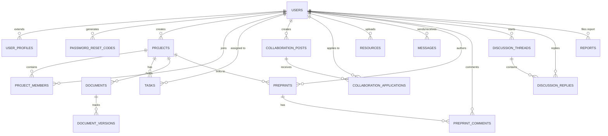

# UiU-ScholarNet Context Memory & Architecture Reference

This document serves as a persistent knowledge base for human developers and AI agents working on the **UiU-ScholarNet** platform. It contains critical information about the project's layout, technology stack, database architecture, and routing structure to facilitate future maintenance and development.

---

## 🏗️ Technology Stack

1. **Frontend:**
   - HTML5, Vanilla JavaScript, Custom CSS.
   - **Framework:** None (No React/Vue). Pure vanilla setup.
   - **Styling:** Custom CSS modules located in `assets/css/` utilizing modern UI/UX design (glassmorphism, subtle micro-animations).

2. **Backend:**
   - Pure PHP 8+ procedural code (No Laravel/Symfony).
   - Custom routing mechanism managed via direct script execution and action handlers (`actions/`).
   - Secure Authentication with `password_hash()` and CSRF token protection.

3. **Database:**
   - MySQL / MariaDB using the `mysqli` extension.
   - Core file: `includes/db_connect.php`.

---

## 📂 Directory Structure

```text
UiU-ScholarNet/
├── actions/                  # Backend processing scripts (controllers)
│   ├── admin_misc/           # Admin panel and content moderation actions
│   ├── auth_user/            # Authentication, Profile & Session management
│   ├── collaboration_messaging/ # Direct Messaging & Collab applications
│   ├── discussion_preprints/ # Research Discussions & Preprint upload actions
│   └── project_task_document/ # Project creation, kanban tasks, doc updates
├── assets/                   # Static assets
│   ├── css/                  # Modular CSS files (e.g., globals.css, dashboard.css)
│   └── js/                   # Vanilla JavaScript files
├── auth/                     # Frontend authentication views (Login/Register)
├── dashboard/                # Main application views (Projects, Preprints, Admin)
├── database/                 # SQL schemas and migration scripts
├── includes/                 # Reusable PHP components (Header, Sidebar, DB connection)
├── scratch/                  # Temporary test scripts
└── uploads/                  # User uploaded content (e.g., preprints)
```

---

## 🗄️ Database Entity-Relationship (ER) Diagram

The system employs a relational database structure designed to manage users, projects, tasks, preprints, and communication.



### Core Tables

1. **`users`**: Contains core authentication data (email, password hash), role (`admin`, `faculty`, `student`), and global stats like `points` and `reputation`.
2. **`projects` & `project_members`**: Handles research projects. Projects have a `status`, `visibility`, and `progress`. The `project_members` table handles many-to-many relationships and permissions.
3. **`tasks`**: Kanban-style tasks tied to projects. Features `status` (`todo`, `inprogress`, `done`) and `priority`.
4. **`preprints`**: Academic papers uploaded to the system. Tracks visibility, downloads, and views.
5. **`collaboration_posts` & `collaboration_applications`**: A job-board style system where researchers can post open slots and users can apply.
6. **`discussion_threads`**: Community forum for academic discussions.

---

## ⚙️ Core Application Workflows

### 1. Authentication & Session Management
- Handled by `includes/session.php` and `includes/auth_check.php`.
- Users log in via `auth/login.php` -> processes via `actions/auth_user/login.php` -> sets `$_SESSION['user_id']`.
- CSRF protection is implemented globally via `includes/csrf.php`. Forms must include a `csrf_token` input.

### 2. The "Action" Pattern
- Frontend views (`dashboard/*.php`) submit forms to PHP processing scripts inside the `actions/` directory.
- The action scripts validate data, perform database operations via `db_query()` (located in `db_connect.php`), and redirect back to the frontend with success/error alerts.
- **Alerts System:** Actions set `$_SESSION['success']` or `$_SESSION['error']`. These are rendered by `includes/alerts.php` in the view.

### 3. Asynchronous Operations (AJAX)
- Some features like fetching user profiles (`actions/get_user_profile.php`) and fetching direct messages (`actions/collaboration_messaging/fetch_messages.php`) bypass full page reloads using the native `fetch()` API in vanilla JavaScript.
- Responses are generally structured in JSON format.

---

## 🎨 UI/UX Guidelines

1. **Vanilla CSS Modularity:** 
   Instead of Tailwind, the application utilizes highly customized, modular CSS. Any new views must import `global.css`, `style.css`, and the specific CSS module for that view (e.g., `dashboard.css`, `projects.css`).
2. **Icons:** 
   FontAwesome 6.4 is standard across the app.
3. **Avatars:** 
   User avatars are generated dynamically utilizing the UI-Avatars API (`ui-avatars.com`).
4. **Design Philosophy:** 
   The UI utilizes "glassmorphism" styling, deep navy primary colors (`#0a1128`), and gold accents (`#d4af37`), favoring high contrast and premium aesthetics. Micro-animations (e.g., hover lifts, fade-ins) are handled via CSS transitions.

---

## 🔒 Security Posture

- **Prepared Statements:** The custom `db_query()` wrapper automatically prepares statements and binds parameters to prevent SQL injection.
- **XSS Protection:** Output must always be sanitized using `htmlspecialchars()` before being echoed in views.
- **Access Control (IDOR Protection):** `auth_check.php` prevents unauthenticated access. Admin-only pages explicitly verify `$_SESSION['user_data']['role'] === 'admin'`. Furthermore, all destructive actions (e.g., `delete_project.php`, `delete_preprint.php`) strictly execute ownership checks using `WHERE user_id = ?` or via `JOIN project_members` constraints prior to execution.
- **CSRF Protection:** State-changing POST requests universally implement `csrf_validate_or_die()` using secure cryptographically random tokens (`bin2hex(random_bytes(32))`) validated via `hash_equals()`.
- **Elite Audit Status (v1.0):** The entire codebase has undergone an exhaustive static analysis review via AI security tooling and OWASP Top 10 guidelines. The system natively mitigates SQLi, XSS, and CSRF vulnerabilities without relying on heavy external frameworks.

---

> **Note for AI Agents:** When modifying this project, prioritize reading this file to understand the architecture. **Do not** attempt to install Node packages or React frameworks, as this codebase relies exclusively on a Vanilla PHP/JS/CSS stack.
