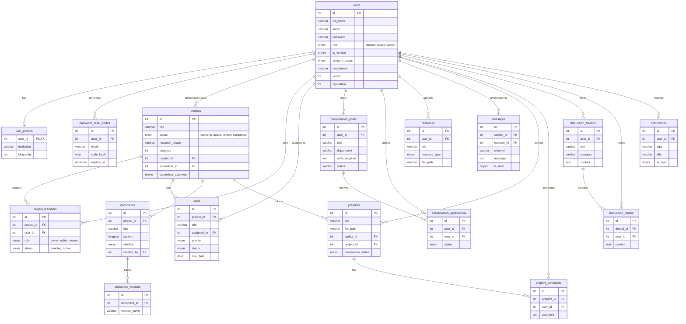

# Database Entity-Relationship Diagram

This diagram maps out the relational schema for the `uiu_scholarnet` database, including primary tables, foreign key relationships, and core attributes.

```mermaid
erDiagram
    users {
        int id PK
        varchar full_name
        varchar email
        varchar password
        enum role "student, faculty, admin"
        tinyint is_verified
        enum account_status
        varchar department
        int points
        int reputation
    }
    user_profiles {
        int user_id PK, FK
        varchar institution
        text biography
    }
    password_reset_codes {
        int id PK
        int user_id FK
        varchar email
        char code_hash
        datetime expires_at
    }
    projects {
        int id PK
        varchar title
        enum status "planning, active, review, completed"
        varchar research_phase
        int progress
        int creator_id FK
        int supervisor_id FK
        tinyint supervisor_approved
    }
    project_members {
        int id PK
        int project_id FK
        int user_id FK
        enum role "owner, editor, viewer"
        enum status "pending, active"
    }
    tasks {
        int id PK
        int project_id FK
        varchar title
        int assigned_to FK
        enum priority
        enum status
        date due_date
    }
    collaboration_posts {
        int id PK
        int user_id FK
        varchar title
        varchar department
        text skills_required
        varchar status
    }
    collaboration_applications {
        int id PK
        int post_id FK
        int user_id FK
        enum status
    }
    resources {
        int id PK
        int user_id FK
        varchar title
        enum resource_type
        varchar file_path
    }
    messages {
        int id PK
        int sender_id FK
        int receiver_id FK
        varchar channel
        text message
        tinyint is_read
    }
    documents {
        int id PK
        int project_id FK
        varchar title
        longtext content
        enum visibility
        int created_by FK
    }
    document_versions {
        int id PK
        int document_id FK
        varchar version_name
    }
    preprints {
        int id PK
        varchar title
        varchar file_path
        int author_id FK
        int project_id FK
        enum moderation_status
    }
    preprint_comments {
        int id PK
        int preprint_id FK
        int user_id FK
        text comment
    }
    discussion_threads {
        int id PK
        int user_id FK
        varchar title
        varchar category
        text content
    }
    discussion_replies {
        int id PK
        int thread_id FK
        int user_id FK
        text content
    }
    notifications {
        int id PK
        int user_id FK
        varchar type
        varchar title
        tinyint is_read
    }

    users ||--o| user_profiles : "has"
    users ||--o{ password_reset_codes : "generates"
    users ||--o{ projects : "creates/supervises"
    users ||--o{ project_members : "joins"
    users ||--o{ tasks : "assigned to"
    users ||--o{ collaboration_posts : "posts"
    users ||--o{ collaboration_applications : "applies"
    users ||--o{ resources : "uploads"
    users ||--o{ messages : "sends/receives"
    users ||--o{ preprints : "authors"
    users ||--o{ preprint_comments : "comments"
    users ||--o{ discussion_threads : "starts"
    users ||--o{ discussion_replies : "replies"
    users ||--o{ notifications : "receives"
    projects ||--o{ project_members : "contains"
    projects ||--o{ tasks : "has"
    projects ||--o{ documents : "holds"
    projects ||--o{ preprints : "links to"
    collaboration_posts ||--o{ collaboration_applications : "receives"
    documents ||--o{ document_versions : "tracks"
    preprints ||--o{ preprint_comments : "has"
    discussion_threads ||--o{ discussion_replies : "contains"
```
